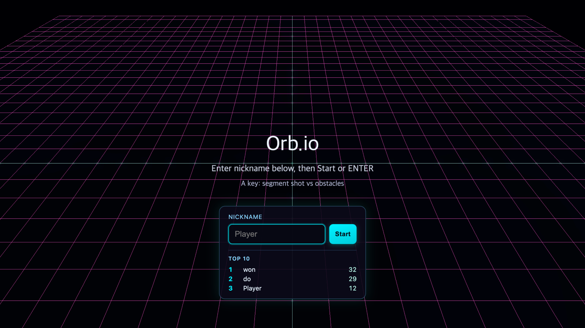
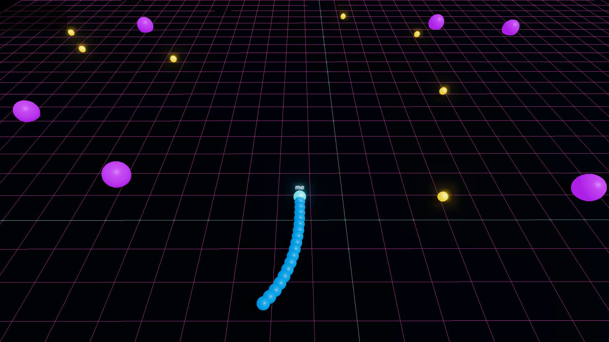
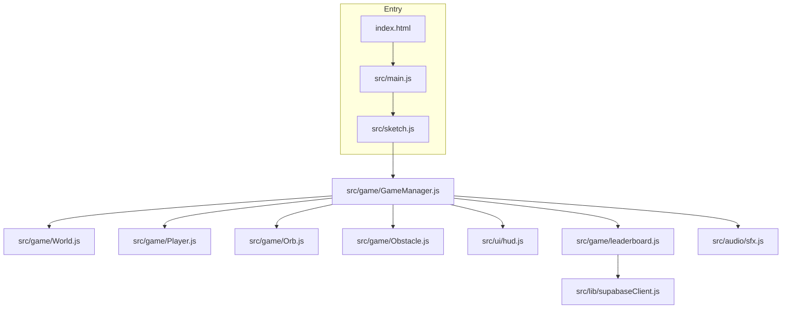

# Orb.io

## Author and links

| Field       | Info                                   |
| ----------- | -------------------------------------- |
| Name        | Chaewon Lee                            |
| Student ID  | 20220552                               |
| Email       | leechaewon@kaist.ac.kr                 |
| Source code | https://github.com/codenamewont/orb.io |
| Live site   | https://orb-io.vercel.app              |
| Demo video  | https://youtu.be/sjQCeS4HBIo           |

## Screenshots

<table width="100%">
  <colgroup>
    <col width="50%" />
    <col width="50%" />
  </colgroup>
  <tr>
    <th align="center" width="50%">Menu</th>
    <th align="center" width="50%">Gameplay</th>
  </tr>
  <tr>
    <td align="center" valign="top" width="50%"></td>
    <td align="center" valign="top" width="50%"></td>
  </tr>
</table>

## How to run it

Run `npm install` once. Then run `npm run dev` and open the local address Vite prints (often port 5173). For a static build use `npm run build` and `npm run preview`.

**Shared leaderboard (optional):** Copy `.env.example` to `.env.local` and set `VITE_SUPABASE_URL` and `VITE_SUPABASE_ANON_KEY`. Run the SQL in `supabase/leaderboard.sql` in your Supabase project. If those variables are missing, the game keeps using `localStorage` only.

**Deployed build:** The live URL above is hosted on **Vercel**. The production leaderboard is backed by **Supabase** (table `orb_leaderboard` from `supabase/leaderboard.sql`), not browser-only storage. `localStorage` is only a fallback if Supabase is not configured or a request fails.

## What the game is

**Orb.io** is a small 3D arena game that feels like [slither.io](http://slither.com/io) style movement. You control a glowing snake made of spheres. The head always moves forward on the floor. You steer by moving the mouse. The body follows the path your head already took.

Your job is to stay alive and grow your score. You pick up _yellow orbs_ on the floor. Each orb adds to your score and makes your tail longer. _Purple balls_ are obstacles. If your head touches an obstacle you lose. If you leave the floor edge you lose. If your head touches your own tail you also lose.

There is one extra attack. Press **A key** to shoot a small ball straight ahead. It costs one tail segment and one point from your score. If it hits an obstacle you get bonus points and the obstacle shrinks. After enough hits the obstacle disappears.

Hold **Space** to move faster while you play.

At the start you type a nickname and press **Start** or **Enter**. The menu shows a _top 10_ list. On the **deployed site** that list comes from **Supabase** so everyone sees the same rankings. If you run the game **locally without** Supabase env vars, scores stay in **`localStorage`** on that browser only.

## Controls

| Input        | What it does                          |
| ------------ | ------------------------------------- |
| Mouse move   | Steer on the ground plane             |
| Space (hold) | Boost speed                           |
| A            | Fire body shot (uses one tail piece)  |
| Enter        | Start or restart when the menu allows |

## How the code is organized

The project uses **Vite** to bundle the app. The 3D view uses **Three.js**. The overlay text uses **p5.js** on a transparent canvas on top of the WebGL canvas.

The file `src/sketch.js` starts p5 and creates one `GameManager`. Each frame it calls `update`, then `renderThree`, then `drawHUD`.

`GameManager` is the main brain. It owns the game state enum (`MENU`, `PLAYING`, `GAME_OVER`). It creates the world, the player, the orb pool, and the obstacles. It reads pointer position for steering. It checks collisions and updates the score. It talks to the DOM for nickname, start button, and leaderboard list.

`World` sets up the Three.js scene, lights, floor, bloom post processing, and the camera follow logic. It also raycasts from screen pixels to a ground point so the mouse maps to world XZ.

`Player` builds the head mesh, body meshes, and the nickname sprite. Movement matches the comment in code: forward motion plus trail based body placement.

`Orb` and `Obstacle` are small classes for pickup spheres and damage spheres. `collision.js` holds shared math like sphere overlap and arena bounds.

`constants.js` keeps tunable numbers in one place so gameplay tweaks are easier.

`leaderboard.js` loads the top 10 and per-nickname best from **Supabase** when `VITE_SUPABASE_*` is set, otherwise from a **`localStorage`** map (and uses that map as a fallback if a remote call fails).

`src/ui/hud.js` draws the p5 text for menu, playing HUD, and game over.

`src/audio/sfx.js` loads short MP3 files from `public/sfx` using URLs from `sfxUrls.js`.

### Simple picture of the flow

### Main classes

| Class or module  | Main job                                                             |
| ---------------- | -------------------------------------------------------------------- |
| `GameManager`    | State machine, spawning, collisions, score, body shot                |
| `World`          | Renderer, scene, camera, bloom, mouse to ground                      |
| `Player`         | Move, trail, meshes, nickname label                                  |
| `Orb`            | Pickup respawn and collect test                                      |
| `Obstacle`       | Placement, hits, scale when damaged                                  |
| `leaderboard.js` | Top 10 and best score: Supabase when env is set, else `localStorage` |

I did not try to follow a big design pattern. Most of the game flow goes through `GameManager`, and things like the player and orbs are normal **classes** in their own files. Tunable numbers live in `constants.js` so I do not scatter raw numbers all over the code.

## Issues and limits you should know

- On the **live site**, the top 10 uses the shared Supabase database. For a **local** run without `.env.local`, the leaderboard stays **only in that browser** on `localStorage`. If Supabase is configured but a request fails, the code falls back to `localStorage` for that call.

- The game expects a **mouse and keyboard**. I did not build touch controls.

- I am not aware of a crash bug right now.

## Special bits worth mentioning

- I wanted the game to feel like you are **competing with other people**, not only chasing a high score on your own machine. A **shared leaderboard** was the missing piece. I added **Supabase** for cloud storage and **deployed on Vercel** with the right env vars, so the live site can show one **top 10** for everyone. That is the main reason the online setup matters to me.

- Bloom lighting and a neon style floor grid give a simple arcade look. The camera follows you but does not spin with your facing so the view stays readable.

- The body shot is a risk reward idea. You get shorter on purpose to try to break obstacles for more points.

## Credits and help

I used this shared **ChatGPT** thread during implementation: [Three.js effects and sound in the game](https://chatgpt.com/share/6a003b9a-8744-83e8-858b-3f18477350de). It helped most with **effect ideas** I could apply in **Three.js**, and with **how to hook up and play sound effects** in the browser.

The files under `public/sfx` are from a **free pack** a YouTuber shared on **Instagram** a while ago. I do not have the original post link or written license text anymore.

I read the official **Three.js** and **p5.js** documentation for the APIs I used in this project.
